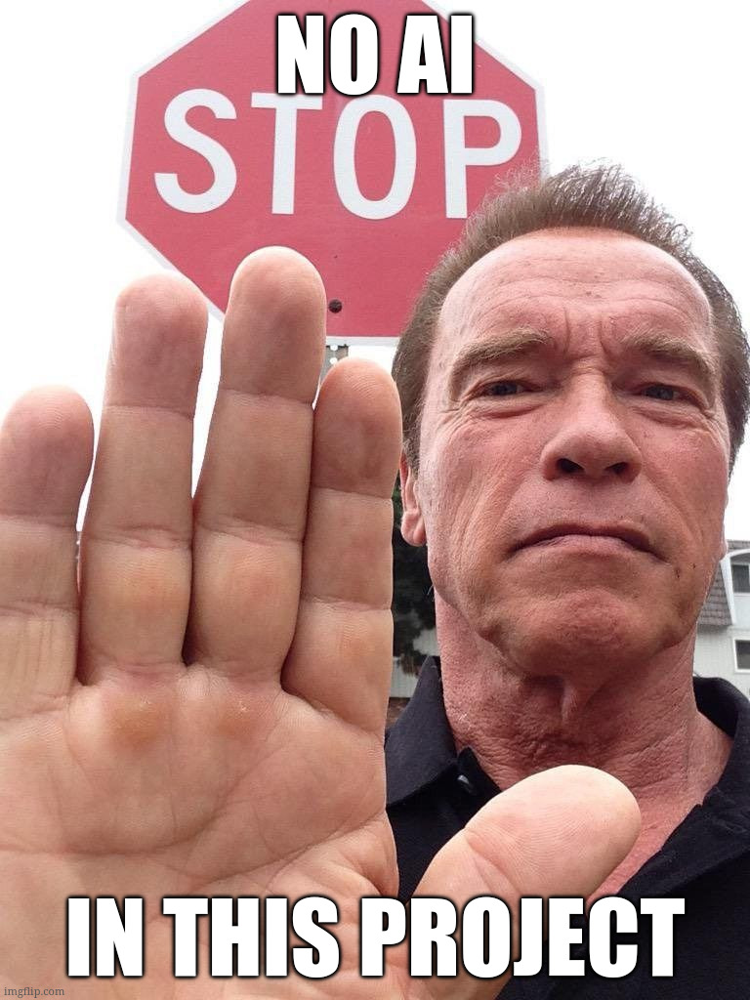

# Icy Tower in Raylib (i hope so)

This is my attempt of recreating my favourite childhood game - Icy Tower.

## Devlog
**2026-06-19**: Added platform management system, but it is clunky and needs refactor, but it is beginning to look nice.

## TODO
- [ ] More cleanup: Input manager maybe, less magic numbers
- [ ] Add posibility to change game stats through game inputs
- [ ] Add camera up-down movement that follow players roughly (with delay) https://www.raylib.com/examples/core/loader.html?name=core_2d_camera
- [ ] Fix platform managment system - shared collision, ot of bounds platform generation, etc
- [x] Add platform managment system
- [x] Fix bug with going through platforms with higher jumps
- [x] Clean up (game state, player properties in player struct, same with platform)

## Development dependencies

- `golangci-lint` for linting
- `air` for hot reloading
- `just` for running commands in `justfile`

## Rules:

